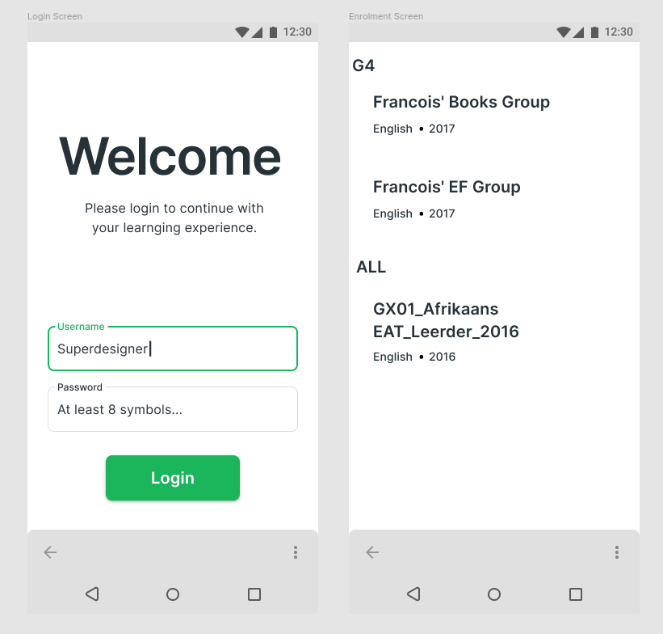

# technical-assignment
Mobile Developer Technical Assignment 2021

> Figma mock that I created for the UI I wanted can be found [here](https://www.figma.com/file/ZVu1LFa63JUWC1uZgo6OS5/Optimi?node-id=2%3A31)

## Project overview

The project is broken down into the following high level modules/components which facilitate common or similar functionality, this is done for the simple reason to allow easier collaboration and maintainability which would be otherwise challenging if the `app` module houses all the layers

> Features will be included in the main application module `app` as a [runtimeOnly](https://docs.gradle.org/current/userguide/java_library_plugin.html#sec:java_library_configurations_graph) module to enforce low coupling between the application and it's feature modules, the benefit of doing this is the fact that we can deactivate certain features or enable them without breaking the build or affecting anything in the project. All the navigation will be handled by `navigation` which will define contracts for destinations though dependency injection

### States Flow

